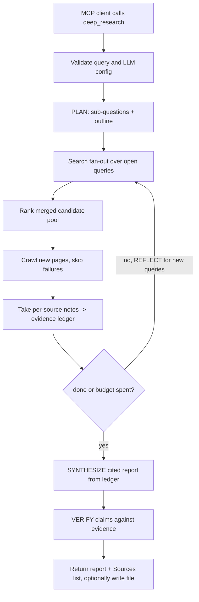

# `deep_research`

## Overview

`deep_research` is an **iterative, multi-source research** tool — a deeper version of [`smart_search`](smart_search.md). Where `smart_search` runs a single pass (one search → rank → crawl → one summary), `deep_research` decomposes the question, runs several rounds of search and reading, reflects on what is still missing, and finally writes a long-form, sectioned report with inline citations and a fact-checking pass.

It reuses the same building blocks as the rest of the server — SearXNG search, the `httpx` → Crawl4AI fetcher, and the pluggable LLM backend (`LLM_PROVIDER`) — so it needs no new credentials beyond what `smart_search` already requires.

The key differences from `smart_search`:

- **Planning.** The LLM first decomposes the question into sub-questions and a report outline.
- **Search fan-out.** Each open query is searched concurrently, and the merged candidate pool is deduplicated across queries and rounds.
- **Per-source notes (evidence ledger).** Instead of concatenating whole pages into one context, each crawled page is distilled into compact, source-tagged notes. This keeps the tool workable on a small local Ollama model and keeps citations honest.
- **Reflection loop.** After each round the LLM decides whether the evidence is sufficient or emits new follow-up queries, bounded by `max_iterations`.
- **Verification.** A final fact-checking pass flags any report claim the collected evidence does not support.
- **Optional file output.** The report can be written to a Markdown or PDF file (reusing the file-generation service) and its path returned.



## Prerequisites

Same as [`smart_search`](smart_search.md#prerequisites):

- Python 3.10 or newer and the project dependencies from `requirements.txt`.
- A reachable SearXNG instance with JSON output enabled.
- An LLM backend: a running local Ollama server (default) or a Gemini API key (`LLM_PROVIDER=gemini`).
- Optional: the `local-mcp[browser]` extra (Crawl4AI) so JavaScript-rendered pages can be crawled instead of skipped.
- To use `output_file`, set `LOCAL_MCP_FILE_OUTPUT_DIR` (or `LOCAL_MCP_DOWNLOAD_DIR`) to the destination folder.

## Setup

Identical to `smart_search` — see [`docs/smart_search.md`](smart_search.md#setup). Choose a backend in `.env`:

```env
# Local Ollama (default, no API key)
LLM_PROVIDER=ollama
OLLAMA_HOST=http://127.0.0.1:11434
OLLAMA_MODEL=qwen2.5:7b
SEARXNG_BASE_URL=http://127.0.0.1:8888
```

Then start the server:

```powershell
python -m local_mcp
```

## Usage

The tool accepts these parameters:

| Parameter | Type | Default | Description |
| --- | --- | --- | --- |
| `query` | string | required | The research question or topic to investigate in depth. |
| `breadth` | integer | `4` | New sources crawled per research round. Range `1`–`10`. |
| `max_iterations` | integer | `2` | Reflect → re-search rounds (research depth). Range `1`–`4`. |
| `max_sources` | integer | `12` | Hard cap on total pages crawled across all rounds. Range `1`–`30`. |
| `time_range` | string | `""` | Optional SearXNG time range: `day`, `month`, or `year`. |
| `verify` | boolean | `true` | Run a fact-checking pass that flags unsupported claims. |
| `output_file` | string | `""` | Optional relative Markdown/PDF filename. When set, the report is also written to a file. |
| `model` | string | `""` | Optional model override for the configured LLM provider. |

Typical workflow:

1. Ask an MCP client a broad or high-stakes research question.
2. The client invokes `deep_research` with the query (and optionally `breadth`/`max_iterations`).
3. The tool plans sub-questions, searches and crawls across rounds, distills each source into notes, reflects to fill gaps, then synthesizes and verifies a report.
4. The tool returns a finished, cited Markdown report — optionally also written to a file.

Example MCP prompt:

```text
Using local-mcp deep_research, produce a report on the trade-offs of local vs. cloud LLM inference for a small team.
```

Example returned shape (Markdown):

```text
# Local vs. Cloud LLM Inference

## Cost
Local inference avoids per-token fees [1], but ... [2].

## Latency
...

## Limitations
Sources [3] and [4] disagree on GPU amortization; no source covered ...

## Verification

All claims are supported by the cited sources.

## Sources

[1] https://example.com/cost-analysis
[2] https://example.org/self-hosting-guide
[3] https://example.net/gpu-economics
```

When no candidate can be crawled in any round, the tool returns an error rather than an empty report.

## How it compares to `smart_search`

| | `smart_search` | `deep_research` |
| --- | --- | --- |
| Passes | 1 (single search) | Iterative (`max_iterations` rounds) |
| Query decomposition | No | Yes (plan step) |
| Evidence handling | Full pages into one summary prompt | Per-source notes (evidence ledger) |
| Gap-driven follow-up searches | No | Yes (reflection step) |
| Output | Short cited summary | Long, sectioned cited report |
| Claim verification | No | Yes (optional) |
| File output | No | Yes (optional) |
| Cost / latency | Low | Higher (more LLM calls) |

Prefer `smart_search` for a quick, direct answer; prefer `deep_research` when depth, coverage, and cross-checking are worth the extra time and tokens.

## Configuration

In addition to the shared `LLM_PROVIDER`, `OLLAMA_*`, `GEMINI_*`, and `SEARXNG_*` variables documented in [`docs/smart_search.md`](smart_search.md#configuration), `deep_research` reads:

| Variable | Default | Description |
| --- | --- | --- |
| `LOCAL_MCP_DEEP_RESEARCH_BREADTH` | `4` | Default new sources crawled per round (the `breadth` default). |
| `LOCAL_MCP_DEEP_RESEARCH_MAX_ITERATIONS` | `2` | Default reflect → re-search rounds (the `max_iterations` default). |
| `LOCAL_MCP_DEEP_RESEARCH_MAX_SOURCES` | `12` | Default hard cap on total sources crawled (the `max_sources` default). |
| `LOCAL_MCP_DEEP_RESEARCH_CANDIDATES_PER_QUERY` | `8` | Candidate results pulled per open query before ranking/dedup. |
| `LOCAL_MCP_DEEP_RESEARCH_SOURCE_CHARS` | `12000` | Max characters of each crawled page passed to note extraction. |
| `LOCAL_MCP_DEEP_RESEARCH_FOLLOWUP_QUERIES` | `4` | Max new follow-up queries accepted from each reflection step. |
| `LOCAL_MCP_FILE_OUTPUT_DIR` / `LOCAL_MCP_DOWNLOAD_DIR` | unset | Destination folder for `output_file`. Required only when `output_file` is used. |

## Troubleshooting

`deep_research` shares the LLM/SearXNG error surface of `smart_search` — see [its troubleshooting section](smart_search.md#troubleshooting) for Ollama/Gemini/SearXNG issues. Additional notes:

### The run is slow

`deep_research` makes many LLM calls (plan + one note-extraction per source + one reflection per round + synthesis + verification). Local Ollama serializes model calls, so latency scales with `max_sources`. Lower `breadth`, `max_iterations`, or `max_sources`, or set `verify=false`, for a faster run.

### `Could not gather any evidence`

Every ranked candidate failed to load in every round (timeouts, blocks, or JavaScript-only pages with no browser fallback). Install the browser extra (`pip install ".[browser]"` then `crawl4ai-setup`), raise `LOCAL_MCP_TIMEOUT_MS`, increase `max_sources`, or widen the query.

### `Report generated but could not be written to a file`

`output_file` was set but `LOCAL_MCP_FILE_OUTPUT_DIR`/`LOCAL_MCP_DOWNLOAD_DIR` is unset, the filename is absolute or contains `..`, or its suffix does not match the file type. The report text is still returned by omitting `output_file`.

## References

- Project implementation: [`local_mcp/tools/deep_research.py`](../local_mcp/tools/deep_research.py), [`local_mcp/tools/smart_search.py`](../local_mcp/tools/smart_search.py), [`local_mcp/llm/client.py`](../local_mcp/llm/client.py), [`local_mcp/web/content.py`](../local_mcp/web/content.py), [`local_mcp/search/searxng.py`](../local_mcp/search/searxng.py), [`local_mcp/file_generation/markdown.py`](../local_mcp/file_generation/markdown.py)
- Related tools: [`smart_search.md`](smart_search.md), [`web_search.md`](web_search.md), [`web_fetch.md`](web_fetch.md)
