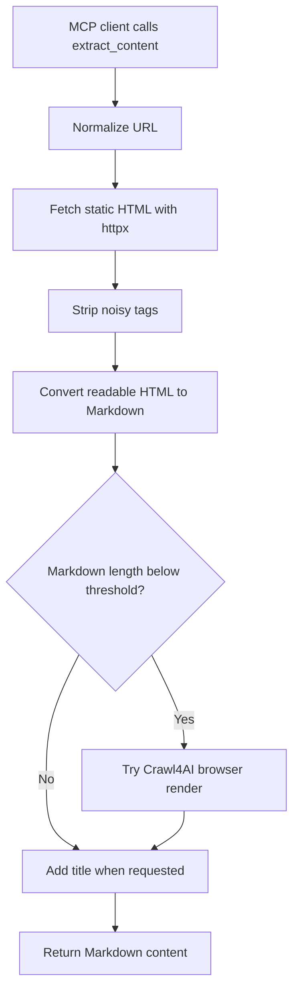

# `extract_content`

## Overview

`extract_content` fetches a web page and returns readable Markdown. It uses static HTML first, removes noisy tags, resolves relative links and images, and falls back to Crawl4AI browser rendering when static HTML produces too little content.

Key capabilities:

- Accepts full URLs or scheme-less input such as `example.com`.
- Fetches pages with `httpx`.
- Removes scripts, styles, templates, SVG, iframes, and forms before Markdown conversion.
- Prefers the page's `<main>` or `<article>` content when available.
- Converts HTML to Markdown with ATX-style headings.
- Resolves relative links and image URLs to absolute URLs.
- Optionally prepends the detected title as a top-level Markdown heading.
- Falls back to Crawl4AI for JavaScript-heavy pages.



## Prerequisites

Required software:

- Python 3.10 or newer.
- Project dependencies from `requirements.txt`.
- Network access to the target page.

Optional software:

- Crawl4AI and browser dependencies for JavaScript-rendered pages.

Required accounts and credentials:

- No account, API key, or token is required.
- This tool does not manage authenticated browser sessions or cookies.

Required permissions:

- Permission to fetch and process the target page.
- Outbound HTTP/HTTPS access from the machine running the MCP server.

## Installation

Install core dependencies:

```powershell
cd D:\MCP\local-mcp
python -m venv .venv
.\.venv\Scripts\Activate.ps1
python -m pip install -r requirements.txt
```

Install optional browser-render support:

```powershell
python -m pip install ".[browser]"
crawl4ai-setup
```

## Setup

1. Install project dependencies.
2. Install Crawl4AI if you need browser rendering.
3. Set a user agent if the target website asks crawlers to identify themselves:

   ```powershell
   $env:LOCAL_MCP_USER_AGENT = "content-extractor/1.0 (+https://example.com/contact)"
   ```

4. Optionally lower or raise the fallback threshold:

   ```powershell
   $env:LOCAL_MCP_MIN_MARKDOWN_CHARS = "300"
   ```

5. Start the server:

   ```powershell
   python server.py
   ```

For OpenWebUI, run:

```powershell
python server.py --http
```

Then add [`openwebui_tool.py`](../openwebui_tool.py) in OpenWebUI.

## Usage

The tool accepts these parameters:

| Parameter | Type | Default | Description |
| --- | --- | --- | --- |
| `url` | string | required | Page URL. Scheme-less input such as `example.com` is allowed. |
| `include_title` | boolean | `true` | Prepends the detected page title as `# Title` when not already present. |

Typical workflow:

1. Find a page manually or with `web_search` or `extract_urls`.
2. Call `extract_content` for that page.
3. Use the returned Markdown for summarization, citation extraction, analysis, or archival notes.

Example MCP prompts:

```text
Using local-mcp, extract the page content from https://example.com.
```

```text
Using local-mcp, extract the page content from example.com without including the title.
```

Example OpenWebUI-style call:

```python
await tools.extract_content(
    url="https://quotes.toscrape.com",
    include_title=True
)
```

Example returned shape:

```markdown
# Example Domain

This domain is for use in illustrative examples in documents.

[More information...](https://www.iana.org/domains/example)
```

## Running the Tool

Run the MCP server over stdio:

```powershell
python server.py
```

Run over HTTP:

```powershell
python server.py --http
```

Check HTTP health:

```powershell
Invoke-WebRequest http://127.0.0.1:3002/health
```

Use the console script when installed:

```powershell
local-mcp --http
```

## Configuration

Supported environment variables:

| Variable | Default | Description |
| --- | --- | --- |
| `LOCAL_MCP_MIN_MARKDOWN_CHARS` | `200` | Static Markdown length below which browser fallback is attempted. |
| `LOCAL_MCP_TIMEOUT_MS` | `15000` | Timeout for static page fetches and Crawl4AI runs. |
| `LOCAL_MCP_USER_AGENT` | `local-mcp/1.0 (+https://github.com/your-org/local-mcp)` | User-Agent sent to target websites. |
| `MCP_TRANSPORT` | `stdio` | Server transport when no CLI flag is supplied. |
| `MCP_HTTP_HOST` | `127.0.0.1` | HTTP server host. |
| `MCP_HTTP_PORT` | `3002` | HTTP server port. |

Example `.env`:

```env
LOCAL_MCP_MIN_MARKDOWN_CHARS=300
LOCAL_MCP_TIMEOUT_MS=30000
LOCAL_MCP_USER_AGENT=content-extractor/1.0 (+https://example.com/contact)
```

Example arguments:

```json
{
  "url": "https://example.com/article",
  "include_title": true
}
```

## Troubleshooting

### `No extractable content found`

The page may be empty, blocked, non-HTML, or mostly JavaScript-rendered. Install Crawl4AI for browser rendering:

```powershell
python -m pip install ".[browser]"
crawl4ai-setup
```

If Crawl4AI is already installed, confirm the page is reachable in a browser.

### Output is too short

The site may render content after user interaction, block automated fetches, or store content behind authentication. Try raising the timeout:

```powershell
$env:LOCAL_MCP_TIMEOUT_MS = "30000"
```

You can also raise `LOCAL_MCP_MIN_MARKDOWN_CHARS` to make browser fallback more likely:

```powershell
$env:LOCAL_MCP_MIN_MARKDOWN_CHARS = "500"
```

### Output includes navigation or footer text

The converter prefers `<main>` or `<article>`, but pages without semantic containers may include broader body content. Use the returned Markdown as a first pass and post-process it in your client if a site has unusual HTML structure.

### `Only http and https URLs are supported`

The input URL used an unsupported scheme. Use an `http` or `https` page URL.

### `returned 404 Not Found`, `refused access`, or timeout errors

The target server returned an HTTP error or blocked the request. Confirm the URL, try again later, or adjust `LOCAL_MCP_USER_AGENT` and `LOCAL_MCP_TIMEOUT_MS`.

## References

- Project implementation: [`server.py`](../server.py), [`extract.py`](../extract.py), [`fetcher.py`](../fetcher.py)
- Project prompts: [`prompt.txt`](../prompt.txt)
- MCP Python SDK: <https://github.com/modelcontextprotocol/python-sdk>
- Crawl4AI documentation: <https://docs.crawl4ai.com/>
- Markdownify package: <https://pypi.org/project/markdownify/>
- Beautiful Soup documentation: <https://beautiful-soup-4.readthedocs.io/en/latest/>
- HTTPX documentation: <https://www.python-httpx.org/>

