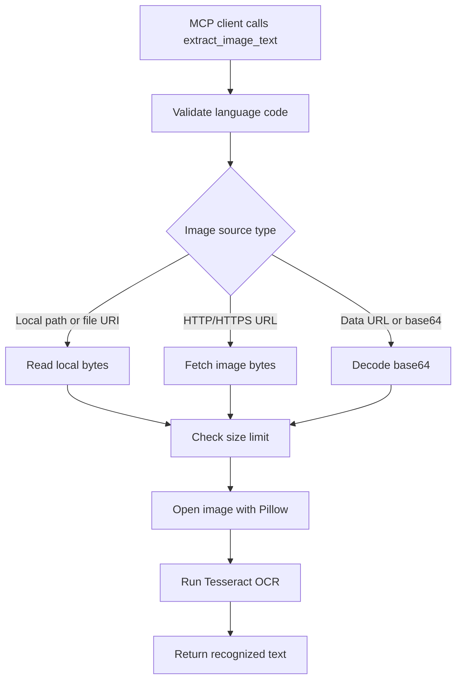

# `extract_image_text`

## Overview

`extract_image_text` extracts text from an image using Tesseract OCR. It accepts local file paths, `file://` URIs, HTTP/HTTPS image URLs, base64 image data URLs, or raw base64 image content.

Key capabilities:

- Runs Tesseract OCR through `pytesseract`.
- Supports Tesseract language codes such as `eng`, `hin`, or combined values like `eng+hin`.
- Auto-detects common Tesseract install locations on Windows.
- Supports `TESSERACT_CMD` when Tesseract is installed in a custom location.
- Handles EXIF orientation before OCR.
- Converts image mode when needed for Tesseract compatibility.
- Enforces a configurable maximum image size.
- Returns only the recognized text, without labels or metadata.



## Prerequisites

Required software:

- Python 3.10 or newer.
- Project Python dependencies from `requirements.txt`.
- Native Tesseract OCR executable installed on the machine.

Required Python packages:

- `Pillow`
- `pytesseract`
- `httpx`

Required accounts and credentials:

- No account, API key, or token is required.

Required permissions:

- Read permission for local image files.
- Network access for remote image URLs.
- Permission to execute the Tesseract binary.

Language data:

- The requested OCR language data must be installed in Tesseract's `tessdata` directory.
- `eng` is commonly installed by default; other languages may need separate installation.

## Installation

Install project dependencies:

```powershell
cd D:\MCP\local-mcp
python -m venv .venv
.\.venv\Scripts\Activate.ps1
python -m pip install -r requirements.txt
```

Install Tesseract OCR.

Windows:

```powershell
# Install Tesseract using your preferred installer or package manager.
# If installed outside the standard path, set TESSERACT_CMD:
$env:TESSERACT_CMD = "C:\Program Files\Tesseract-OCR\tesseract.exe"
```

macOS:

```bash
brew install tesseract
```

Linux:

```bash
sudo apt-get update
sudo apt-get install tesseract-ocr
```

Install extra language packs as needed. For example, on Debian or Ubuntu:

```bash
sudo apt-get install tesseract-ocr-hin
```

## Setup

1. Install Python dependencies.
2. Install the native Tesseract executable.
3. Confirm Tesseract runs:

   ```powershell
   tesseract --version
   ```

4. Set `TESSERACT_CMD` if the executable is not on `PATH` and not in a standard Windows install directory:

   ```powershell
   $env:TESSERACT_CMD = "C:\Program Files\Tesseract-OCR\tesseract.exe"
   ```

5. Optionally configure OCR limits or Tesseract options:

   ```powershell
   $env:LOCAL_MCP_OCR_MAX_IMAGE_BYTES = "20971520"
   $env:LOCAL_MCP_TESSERACT_CONFIG = "--psm 6"
   ```

6. Start the MCP server:

   ```powershell
   python server.py
   ```

For OpenWebUI:

```powershell
python server.py --http
```

Then add [`openwebui_tool.py`](../openwebui_tool.py) in OpenWebUI.

## Usage

The tool accepts these parameters:

| Parameter | Type | Default | Description |
| --- | --- | --- | --- |
| `image` | string | required | Image file path, `file://` URI, image URL, data URL, or base64-encoded image content. |
| `lang` | string | `eng` | Tesseract language code, such as `eng` or `eng+hin`. |

Typical workflow:

1. Provide the image source.
2. Set `lang` to match the image text.
3. Run the tool.
4. Use the returned plain text in a summary, extraction, or data-entry workflow.

Example MCP prompts:

```text
Using local-mcp, extract text from the image at C:\path\to\image.png.
```

```text
Using local-mcp, extract text from the image URL https://example.com/image.png.
```

Example OpenWebUI-style calls:

```python
await tools.extract_image_text(
    image=r"C:\Users\me\Pictures\receipt.png",
    lang="eng"
)
```

```python
await tools.extract_image_text(
    image="https://example.com/sign.png",
    lang="eng"
)
```

Combined-language OCR:

```python
await tools.extract_image_text(
    image=r"C:\Users\me\Pictures\bilingual.png",
    lang="eng+hin"
)
```

Data URL example:

```text
data:image/png;base64,iVBORw0KGgoAAAANSUhEUgAA...
```

## Running the Tool

Run the MCP server over stdio:

```powershell
python server.py
```

Run over HTTP:

```powershell
python server.py --http
```

Check HTTP health:

```powershell
Invoke-WebRequest http://127.0.0.1:3002/health
```

Use the console script when installed:

```powershell
local-mcp --http
```

## Configuration

Supported environment variables:

| Variable | Default | Description |
| --- | --- | --- |
| `TESSERACT_CMD` | auto-detected | Full path to the Tesseract executable. |
| `LOCAL_MCP_OCR_MAX_IMAGE_BYTES` | `20971520` | Maximum allowed image size in bytes. |
| `LOCAL_MCP_TESSERACT_CONFIG` | empty | Extra config string passed to `pytesseract.image_to_string`. |
| `LOCAL_MCP_TIMEOUT_MS` | `15000` | Timeout for fetching remote image URLs. |
| `LOCAL_MCP_USER_AGENT` | `local-mcp/1.0 (+https://github.com/your-org/local-mcp)` | User-Agent sent when fetching image URLs. |
| `MCP_TRANSPORT` | `stdio` | Server transport when no CLI flag is supplied. |
| `MCP_HTTP_HOST` | `127.0.0.1` | HTTP server host. |
| `MCP_HTTP_PORT` | `3002` | HTTP server port. |

Example `.env`:

```env
TESSERACT_CMD=C:\Program Files\Tesseract-OCR\tesseract.exe
LOCAL_MCP_OCR_MAX_IMAGE_BYTES=20971520
LOCAL_MCP_TESSERACT_CONFIG=--psm 6
LOCAL_MCP_TIMEOUT_MS=30000
```

Example arguments:

```json
{
  "image": "https://example.com/receipt.png",
  "lang": "eng"
}
```

## Troubleshooting

### `Tesseract OCR executable was not found`

Install Tesseract or set `TESSERACT_CMD`:

```powershell
$env:TESSERACT_CMD = "C:\Program Files\Tesseract-OCR\tesseract.exe"
```

Then restart the MCP server.

### `Tesseract language must be a language code`

The `lang` value can only contain letters, numbers, underscores, plus signs, and hyphens. Use values such as:

```text
eng
hin
eng+hin
```

### `Error opening data file ... traineddata`

The requested Tesseract language data is not installed. Install the relevant language pack and confirm Tesseract can find its `tessdata` directory.

### `Image not found or unsupported image source`

Check that the local path exists, the server process has permission to read it, or the remote URL is reachable. Wrap Windows paths in raw strings when calling from Python:

```python
r"C:\Users\me\Pictures\image.png"
```

### `Only base64 image data URLs are supported`

Data URLs must include `;base64`:

```text
data:image/png;base64,<payload>
```

### `Image is too large`

The image exceeds `LOCAL_MCP_OCR_MAX_IMAGE_BYTES`. Resize or compress the image, or raise the limit if the environment can safely process larger files:

```powershell
$env:LOCAL_MCP_OCR_MAX_IMAGE_BYTES = "52428800"
```

### Poor OCR quality

Try these improvements:

- Use a higher-resolution image.
- Crop to the text area.
- Increase contrast before OCR.
- Set a page segmentation mode through `LOCAL_MCP_TESSERACT_CONFIG`, such as `--psm 6`.
- Use the correct language code or combined languages.

## References

- Project implementation: [`server.py`](../server.py), [`ocr.py`](../ocr.py), [`fetcher.py`](../fetcher.py)
- Project prompts: [`prompt.txt`](../prompt.txt)
- Tesseract command-line usage: <https://tesseract-ocr.github.io/tessdoc/Command-Line-Usage.html>
- Tesseract documentation: <https://tesseract-ocr.github.io/tessdoc/>
- pytesseract package: <https://github.com/madmaze/pytesseract>
- Pillow documentation: <https://pillow.readthedocs.io/>
- MCP Python SDK: <https://github.com/modelcontextprotocol/python-sdk>

