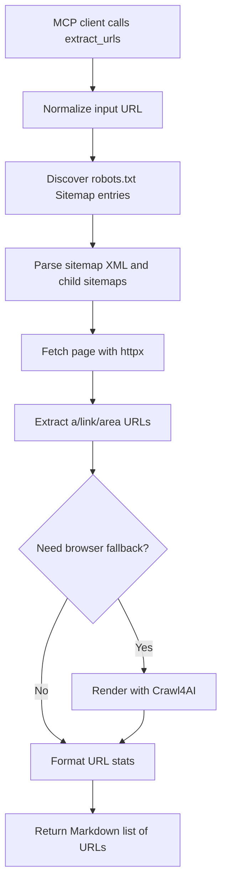

# `extract_urls`

## Overview

`extract_urls` discovers unique absolute URLs from a page or site. It combines sitemap discovery, XML sitemap parsing, static HTML link extraction, and optional browser rendering through Crawl4AI.

Key capabilities:

- Accepts full URLs or scheme-less input such as `example.com`.
- Reads sitemap entries from `robots.txt`.
- Checks the conventional `/sitemap.xml` location.
- Recursively parses sitemap indexes and URL sets.
- Extracts links from static HTML with `httpx` and Beautiful Soup.
- Falls back to Crawl4AI browser rendering when static HTML has no usable links or path-scoped crawling needs more links.
- Can restrict results to the same host and path prefix.
- Returns source counts for `robots.txt`, `sitemap.xml`, `httpx`, and `Crawl4AI`.



## Prerequisites

Required software:

- Python 3.10 or newer.
- Project dependencies from `requirements.txt`.
- Network access to the target website.

Optional software:

- Crawl4AI and its browser dependencies for JavaScript-rendered pages.

Required accounts and credentials:

- No account or API key is required.
- Some websites may require authentication or block automated requests; this tool does not manage login sessions.

Required permissions:

- Permission to crawl the target website.
- Local environment should allow outbound HTTP/HTTPS requests.

## Installation

Install core dependencies:

```powershell
cd D:\MCP\local-mcp
python -m venv .venv
.\.venv\Scripts\Activate.ps1
python -m pip install -r requirements.txt
```

Install the optional browser-render fallback:

```powershell
python -m pip install ".[browser]"
crawl4ai-setup
```

`crawl4ai` is intentionally not in `requirements.txt` because it brings heavier browser dependencies. Install it only for local or server environments that can run a headless browser.

## Setup

1. Install the dependencies.
2. Decide whether browser fallback is needed.
3. Set a responsible user agent if crawling production websites:

   ```powershell
   $env:LOCAL_MCP_USER_AGENT = "my-team-url-audit/1.0 (+https://example.com/contact)"
   ```

4. Optionally adjust timeouts and default URL limit:

   ```powershell
   $env:LOCAL_MCP_TIMEOUT_MS = "30000"
   $env:LOCAL_MCP_URL_LIMIT = "1000"
   ```

5. Start the MCP server:

   ```powershell
   python -m local_mcp
   ```

For OpenWebUI:

```powershell
python -m local_mcp --http
```

Then configure [`integrations/openwebui_tool.py`](../integrations/openwebui_tool.py) in OpenWebUI.

## Usage

The tool accepts these parameters:

| Parameter | Type | Default | Description |
| --- | --- | --- | --- |
| `url` | string | required | Page or site URL. Scheme-less input such as `example.com` is allowed. |
| `same_domain` | boolean | `true` | Only return URLs on the input URL hostname. |
| `same_path` | boolean | `true` | Only return URLs under the input URL path prefix. |
| `limit` | integer | `LOCAL_MCP_URL_LIMIT` or `500` | Maximum number of unique URLs. Allowed range: `1` to `5000`. |

Typical workflow:

1. Call `extract_urls` with a site root or section URL.
2. Review the URL stats to understand where links were found.
3. Feed selected URLs into `web_fetch`.
4. Adjust `same_domain`, `same_path`, and `limit` if the first crawl is too narrow or too broad.

Example MCP prompts:

```text
Using local-mcp, extract URLs from https://example.com.
```

```text
Using local-mcp, extract URLs from https://quotes.toscrape.com with same_domain=true, same_path=true, and limit=25.
```

Example OpenWebUI-style call:

```python
await tools.extract_urls(
    url="https://www.python.org",
    same_domain=False,
    same_path=False,
    limit=100
)
```

Example returned shape:

```markdown
Render method used: httpx + crawl4ai
URL Stats:
- Total URLs: 3
- robots.txt: 1
- sitemap.xml: 1
- httpx: 1
- Crawl4AI: 0
URLs:
- [https://example.com/about](https://example.com/about) (sitemap.xml)
- [https://example.com/blog](https://example.com/blog) (robots.txt)
- [https://example.com/contact](https://example.com/contact) (httpx)
```

## Running the Tool

Run the MCP server over stdio:

```powershell
python -m local_mcp
```

Run over HTTP:

```powershell
python -m local_mcp --http
```

Check HTTP health:

```powershell
Invoke-WebRequest http://127.0.0.1:3002/health
```

Use the console script when installed:

```powershell
local-mcp --http
```

## Configuration

Supported environment variables:

| Variable | Default | Description |
| --- | --- | --- |
| `LOCAL_MCP_URL_LIMIT` | `500` | Default `limit` value when the client does not provide one. |
| `LOCAL_MCP_TIMEOUT_MS` | `15000` | Timeout for static fetches and Crawl4AI browser runs. |
| `LOCAL_MCP_USER_AGENT` | `local-mcp/1.0 (+https://github.com/your-org/local-mcp)` | User-Agent sent to target websites. |
| `MCP_TRANSPORT` | `stdio` | Server transport when no CLI flag is supplied. |
| `MCP_HTTP_HOST` | `127.0.0.1` | HTTP server host. |
| `MCP_HTTP_PORT` | `3002` | HTTP server port. |

Example `.env`:

```env
LOCAL_MCP_URL_LIMIT=1000
LOCAL_MCP_TIMEOUT_MS=30000
LOCAL_MCP_USER_AGENT=my-crawler/1.0 (+https://example.com/contact)
```

Example arguments for a section crawl:

```json
{
  "url": "https://example.com/blog",
  "same_domain": true,
  "same_path": true,
  "limit": 250
}
```

With `same_path=true`, `https://example.com/blog` returns `/blog` and `/blog/...` URLs, but filters out `/pricing` or `/docs`.

## Troubleshooting

### `Only http and https URLs are supported`

The `url` parameter used an unsupported scheme such as `file:` or `ftp:`. Use an `http` or `https` URL.

### `Could not connect` or timeout errors

The target site may be unreachable, DNS may be failing, or the server may be slow. Confirm the URL in a browser and consider increasing the timeout:

```powershell
$env:LOCAL_MCP_TIMEOUT_MS = "30000"
```

### `Browser rendering is unavailable`

The page needed browser fallback, but `crawl4ai` is not installed. Install the optional dependency:

```powershell
python -m pip install ".[browser]"
crawl4ai-setup
```

### Few or no URLs found

Try these adjustments:

- Set `same_path=false` if the input URL is a subsection and you want the whole domain.
- Set `same_domain=false` if external links are expected.
- Increase `limit`.
- Install Crawl4AI if the site renders links with JavaScript.

### `returned 404 Not Found` or `refused access`

The target page may not exist or may block automated requests. Try a different URL, use a clearer user agent, or avoid crawling protected pages.

## References

- Project implementation: [`local_mcp/tools/web.py`](../local_mcp/tools/web.py), [`local_mcp/web/sitemap.py`](../local_mcp/web/sitemap.py), [`local_mcp/web/html.py`](../local_mcp/web/html.py), [`local_mcp/web/fetcher.py`](../local_mcp/web/fetcher.py)
- Project prompts: [`prompt.txt`](../prompt.txt)
- MCP Python SDK: <https://github.com/modelcontextprotocol/python-sdk>
- Crawl4AI documentation: <https://docs.crawl4ai.com/>
- Beautiful Soup documentation: <https://beautiful-soup-4.readthedocs.io/en/latest/>
- HTTPX documentation: <https://www.python-httpx.org/>
