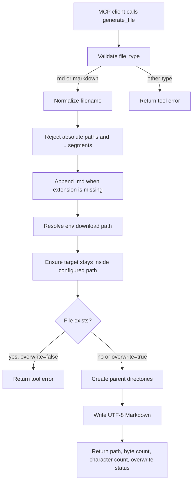

# `generate_file`

Generate a local Markdown file from supplied content.

The MVP intentionally supports only Markdown output. The tool accepts `md` or `markdown` as `file_type`; docx, xlsx, pptx, and pdf can be added later behind the same interface.

## How It Works



## Parameters

| Parameter | Type | Default | Description |
| --- | --- | --- | --- |
| `filename` | string | required | Output Markdown filename or relative path. The `.md` extension is appended when omitted. |
| `content` | string | required | Markdown content to write. |
| `file_type` | string | `md` | Output file type. MVP supports only `md`/`markdown`. |
| `overwrite` | boolean | `false` | Replace an existing file at the target path. |
| `ensure_trailing_newline` | boolean | `true` | Append a trailing newline to non-empty Markdown content. |

## Path Behavior

- `filename` must be relative.
- The destination folder must be configured with `LOCAL_MCP_FILE_OUTPUT_DIR` or `LOCAL_MCP_DOWNLOAD_DIR`.
- `..` path segments are rejected.
- Parent directories are created automatically.
- Existing files are preserved unless `overwrite` is `true`.
- Only `.md` output files are accepted for the MVP.

## Download Location

Set the download location in `.env`:

```env
LOCAL_MCP_FILE_OUTPUT_DIR=~/Downloads/local-mcp
```

`LOCAL_MCP_DOWNLOAD_DIR` is also supported as a friendlier alias. Precedence is:

```text
LOCAL_MCP_FILE_OUTPUT_DIR -> LOCAL_MCP_DOWNLOAD_DIR
```

If neither environment variable is set, the tool returns:

```text
Download path not defined. Set LOCAL_MCP_FILE_OUTPUT_DIR or LOCAL_MCP_DOWNLOAD_DIR in .env.
```

## Example

```json
{
  "filename": "notes/project-brief",
  "content": "# Project Brief\n\n- Owner: Local MCP\n- Status: MVP\n",
  "file_type": "md"
}
```

With `LOCAL_MCP_FILE_OUTPUT_DIR=~/Downloads/local-mcp`, this creates:

```text
~/Downloads/local-mcp/notes/project-brief.md
```
