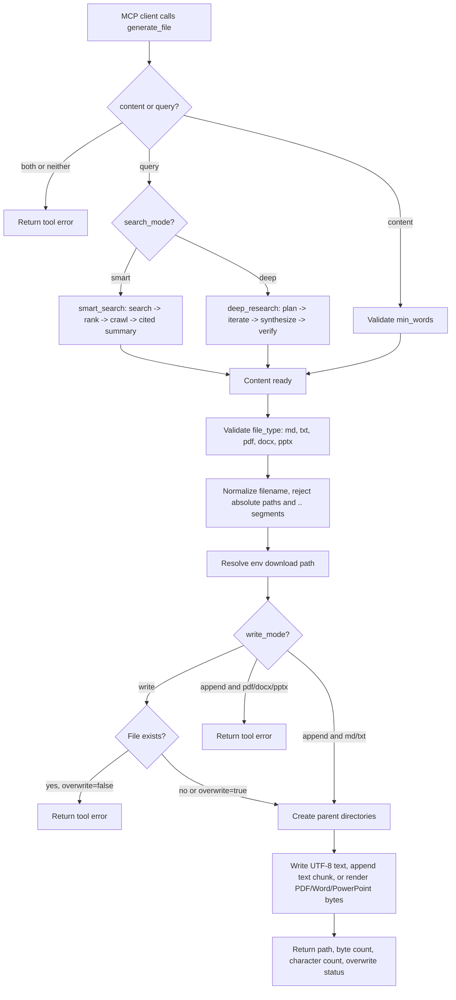

# `generate_file`

Generate a local file from supplied content, or research a query online first and write the answer.

One tool, two input modes — provide exactly one of `content` or `query`:

- `content` — the supplied Markdown-like text is written as-is.
- `query` — the question is answered with web research first (`search_mode="smart"` runs a fast single-pass `smart_search` summary; `search_mode="deep"` runs the iterative `deep_research` report) and the result is written to the file.

Supported output formats: Markdown (`md`/`markdown`), plain text (`txt`), `pdf`, Word (`doc`/`docx`), and PowerPoint (`ppt`/`pptx`). Legacy `doc`/`ppt` requests are written as modern `.docx`/`.pptx`, which Word and PowerPoint open natively.

Use `write_mode="append"` to build larger Markdown or text files in chunks when a smaller AI model cannot provide the whole document in one tool call. PDF, Word, and PowerPoint output must be generated with `write_mode="write"` and the complete content.

## How It Works



## Parameters

| Parameter | Type | Default | Description |
| --- | --- | --- | --- |
| `filename` | string | required | Output filename or relative path. The extension matching `file_type` is appended when omitted. |
| `content` | string | `""` | Ready-made Markdown-like content to write. Leave empty when using `query`. |
| `query` | string | `""` | Research question to answer with web research; the answer is written to the file. Leave empty when using `content`. |
| `search_mode` | string | `smart` | Research pipeline for query mode: `smart` (fast single-pass summary) or `deep` (iterative long-form report). |
| `file_type` | string | `md` | Output file type: `md`/`markdown`, `txt`, `pdf`, `doc`/`docx`, or `ppt`/`pptx`. A matching filename extension also selects the type. |
| `overwrite` | boolean | `false` | Replace an existing file at the target path. |
| `write_mode` | string | `write` | `write` creates/replaces content. `append` adds a chunk (Markdown and text only). `chunk` is accepted as an alias for `append`. |
| `max_sources` | integer | `0` | Maximum web sources for query mode. `0` uses the search mode's default (3 for smart, 12 for deep). |
| `time_range` | string | `""` | Optional SearXNG time range for query mode: `day`, `month`, or `year`. |
| `model` | string | `""` | Optional model override for the configured LLM provider in query mode. |
| `min_words` | integer | `0` | Minimum word count required for supplied `content`. Ignored in query mode. |
| `ensure_trailing_newline` | boolean | `true` | Append a trailing newline to non-empty Markdown/text content. Ignored for binary output. |

Query mode uses the same pluggable LLM backend as `smart_search`/`deep_research`: local Ollama by default, or Google Gemini with `LLM_PROVIDER=gemini`.

## Path Behavior

- `filename` must be relative.
- The destination folder must be configured with `LOCAL_MCP_FILE_OUTPUT_DIR` or `LOCAL_MCP_DOWNLOAD_DIR`.
- `..` path segments are rejected.
- Parent directories are created automatically.
- Existing files are preserved unless `overwrite` is `true`.
- `append` mode creates Markdown/text files if they do not exist and never overwrites existing content.
- PDF, Word, and PowerPoint output support `write` mode only.
- Accepted output extensions: `.md`, `.markdown`, `.txt`, `.pdf`, `.doc`, `.docx`, `.ppt`, `.pptx`. Legacy `.doc`/`.ppt` filenames are normalized to `.docx`/`.pptx`.

## Download Location

Set the download location in `.env`:

```env
LOCAL_MCP_FILE_OUTPUT_DIR=~/Downloads/local-mcp
```

`LOCAL_MCP_DOWNLOAD_DIR` is also supported as a friendlier alias. Precedence is:

```text
LOCAL_MCP_FILE_OUTPUT_DIR -> LOCAL_MCP_DOWNLOAD_DIR
```

If neither environment variable is set, the tool returns:

```text
Download path not defined. Set LOCAL_MCP_FILE_OUTPUT_DIR or LOCAL_MCP_DOWNLOAD_DIR in .env.
```

## Content Example

```json
{
  "filename": "notes/project-brief",
  "content": "# Project Brief\n\n- Owner: Local MCP\n- Status: MVP\n",
  "file_type": "md"
}
```

With `LOCAL_MCP_FILE_OUTPUT_DIR=~/Downloads/local-mcp`, this creates:

```text
~/Downloads/local-mcp/notes/project-brief.md
```

## Query Examples

Fast researched answer written to a PDF:

```json
{
  "filename": "research/mcp-protocol.pdf",
  "query": "What is the Model Context Protocol and how does it work?",
  "search_mode": "smart"
}
```

Deep research report written to a Word document:

```json
{
  "filename": "research/local-llm-landscape",
  "query": "Compare the current local LLM inference runtimes",
  "search_mode": "deep",
  "file_type": "docx"
}
```

## PowerPoint Example

Each `#`/`##` heading in the content starts a new slide; the lines below it become the slide's bullets.

```json
{
  "filename": "decks/project-brief",
  "content": "# Project Brief\n\n- Owner: Local MCP\n- Status: Draft\n\n## Roadmap\n\n- MVP in Q1\n- Beta in Q2\n",
  "file_type": "pptx"
}
```

## Chunked Example

First chunk:

```json
{
  "filename": "reports/large-report",
  "content": "# Large Report\n\nFirst section...",
  "write_mode": "write",
  "overwrite": true
}
```

Later chunks:

```json
{
  "filename": "reports/large-report",
  "content": "Next section...",
  "write_mode": "append"
}
```
