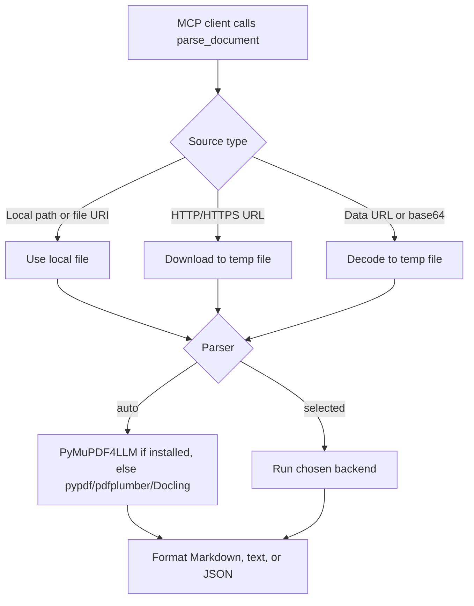

# `parse_document`

## Overview

`parse_document` parses PDFs and documents into Markdown, plain text, or JSON. It accepts local paths, `file://` URIs, HTTP/HTTPS URLs, base64 data URLs, or raw base64 document content.

The tool is local by default. Frontier-model PDF ingestion is best handled by sending the PDF directly to a model client that supports native PDF input; this MCP tool focuses on open-source parsers and does not send documents to a remote model provider.

Key capabilities:

- Uses `pypdf` by default for lightweight digital PDF text extraction.
- Uses `pymupdf4llm` when installed for fast LLM/RAG-friendly PDF Markdown.
- Uses `Docling` when selected for structured document conversion and OCR-heavy workflows.
- Uses `Marker` when selected for deep-learning parsing and Apple Silicon MPS acceleration.
- Uses `MinerU` when selected for CJK, scientific, formula, and complex-layout documents.
- Uses `pdfplumber` when selected for text, tables, and table coordinates.
- Supports page selection for `pypdf`, `pdfplumber`, `pymupdf4llm`, and `marker`.
- Enforces a configurable maximum document size and CLI parser timeout.



## Parser Selection

| Parser | Best for | Notes |
| --- | --- | --- |
| `auto` | Most calls | Prefers `pymupdf4llm` for PDFs when installed, then `pypdf`, then other available local engines. |
| `pypdf` | Lightweight digital PDF text | Installed with core requirements; no OCR or table coordinates. |
| `pymupdf4llm` | Fast digital PDFs for RAG | Optional; good first choice for clean PDFs. |
| `pdfplumber` | Tables and coordinates | Optional; JSON output includes table bounding boxes. |
| `docling` | Structured + OCR documents | Optional; good for RAG pipelines and mixed document formats. |
| `marker` | Deep-learning parsing | Optional; supports CPU/GPU/MPS and can use Apple Silicon MPS. |
| `mineru` | CJK, scientific, formulas, complex layouts | Optional; defaults to the CPU-friendly `pipeline` backend. |
| `text` | Plain text-like files | Supports `.txt`, `.md`, `.csv`, `.json`, `.html`, `.xml`, `.yaml`, and logs. |

## Prerequisites

Required software:

- Python 3.10 or newer.
- Project Python dependencies from `requirements.txt`.

Required Python packages for the default path:

- `pypdf`

Optional parser packages:

- `pymupdf4llm`
- `pdfplumber`
- `docling`
- `marker-pdf`
- `mineru`

Required accounts and credentials:

- None for local parsers.
- Frontier native PDF ingestion is not proxied by this tool; use your model provider's client directly when you want combined vision + text ingestion.

## Installation

Install project dependencies:

```powershell
cd D:\MCP\local-mcp
python -m venv .venv
.\.venv\Scripts\Activate.ps1
python -m pip install -r requirements.txt
```

Install optional parser groups:

```powershell
python -m pip install ".[document-fast]"
python -m pip install ".[document-structured]"
python -m pip install ".[document-deep]"
```

Individual installs:

```powershell
python -m pip install pymupdf4llm pdfplumber
python -m pip install docling
python -m pip install marker-pdf
python -m pip install "mineru[all]"
```

On an M1 Max:

- `marker` can use MPS through PyTorch/Marker device detection.
- `docling`, `pymupdf4llm`, `pdfplumber`, and `pypdf` run comfortably on CPU for ordinary documents.
- Heavy OCR and deep parsers are best run sequentially, especially for long PDFs.

## Usage

The tool accepts these parameters:

| Parameter | Type | Default | Description |
| --- | --- | --- | --- |
| `document` | string | required | Document file path, `file://` URI, HTTP(S) URL, data URL, or base64 content. |
| `parser` | string | `auto` | `auto`, `pypdf`, `pymupdf4llm`, `pdfplumber`, `docling`, `marker`, `mineru`, or `text`. |
| `output_format` | string | `markdown` | `markdown`, `text`, or `json`. |
| `pages` | string | empty | Optional 1-based page range, such as `1-3,5`. |
| `include_metadata` | boolean | `true` | Include parser/source metadata before Markdown or text output. |
| `max_chars` | integer | `120000` | Maximum content characters returned before truncation. |

Example MCP prompts:

```text
Using local-mcp, parse the PDF at C:\path\to\paper.pdf.
```

```text
Using local-mcp, parse C:\path\to\paper.pdf with parser=pymupdf4llm and pages=1-5.
```

```text
Using local-mcp, parse C:\path\to\report.pdf with parser=pdfplumber and output_format=json.
```

```text
Using local-mcp, parse C:\path\to\scientific.pdf with parser=mineru.
```

Example OpenWebUI-style call:

```python
await tools.parse_document(
    document=r"C:\Users\me\Documents\paper.pdf",
    parser="auto",
    output_format="markdown",
    pages="1-3",
)
```

## Running the Tool

Run the MCP server over stdio:

```powershell
python server.py
```

Run over HTTP:

```powershell
python server.py --http
```

For OpenWebUI, run HTTP mode and add [`integrations/openwebui_tool.py`](../integrations/openwebui_tool.py) in OpenWebUI.

## Configuration

Supported environment variables:

| Variable | Default | Description |
| --- | --- | --- |
| `LOCAL_MCP_DOCUMENT_MAX_BYTES` | `104857600` | Maximum accepted document size in bytes. |
| `LOCAL_MCP_DOCUMENT_PARSER_TIMEOUT_S` | `900` | Timeout for Marker and MinerU CLI parsers. |
| `LOCAL_MCP_DOCUMENT_TMPDIR` | `.tmp/documents` | Directory for downloaded/base64 documents and parser output temp files. |
| `LOCAL_MCP_MARKER_CMD` | auto-detected | Optional path to `marker_single`. |
| `LOCAL_MCP_MINERU_CMD` | auto-detected | Optional path to `mineru`. |
| `LOCAL_MCP_MINERU_BACKEND` | `pipeline` | MinerU backend passed with `-b`; use `pipeline` for CPU-friendly parsing. |
| `LOCAL_MCP_TIMEOUT_MS` | `15000` | Timeout for fetching remote documents. |
| `LOCAL_MCP_USER_AGENT` | `local-mcp/1.0 (+https://github.com/your-org/local-mcp)` | User-Agent sent when fetching document URLs. |

## Troubleshooting

### `No document parser is available`

Install the core dependencies:

```powershell
python -m pip install -r requirements.txt
```

For stronger parsing, install one of the optional groups.

### `pymupdf4llm is not installed`

Install the fast document parser group:

```powershell
python -m pip install ".[document-fast]"
```

### `marker is not installed or not on PATH`

Install Marker and make sure `marker_single` is on `PATH`:

```powershell
python -m pip install marker-pdf
```

Set `LOCAL_MCP_MARKER_CMD` if the executable is in a custom location.

### `mineru is not installed or not on PATH`

Install MinerU and make sure `mineru` is on `PATH`:

```powershell
python -m pip install "mineru[all]"
```

Set `LOCAL_MCP_MINERU_CMD` if the executable is in a custom location.

### Poor scanned-PDF results

Use `docling`, `marker`, or `mineru` instead of `pypdf`. These parsers are heavier, but they are designed for OCR and complex layout recovery.

### Need frontier native PDF ingestion

Use a frontier model client that accepts PDFs directly. This local tool does not proxy documents to remote providers, which keeps local parsing credential-free and private by default.

## References

- Project implementation: [`local_mcp/tools/documents.py`](../local_mcp/tools/documents.py), [`local_mcp/documents/`](../local_mcp/documents/)
- Project prompts: [`prompt.txt`](../prompt.txt)
- PyMuPDF4LLM documentation: <https://pymupdf.readthedocs.io/>
- Docling documentation: <https://docling-project.github.io/docling/>
- Marker package: <https://pypi.org/project/marker-pdf/>
- MinerU documentation: <https://opendatalab.github.io/MinerU/>
- pdfplumber package: <https://github.com/jsvine/pdfplumber>
- pypdf documentation: <https://pypdf.readthedocs.io/>
