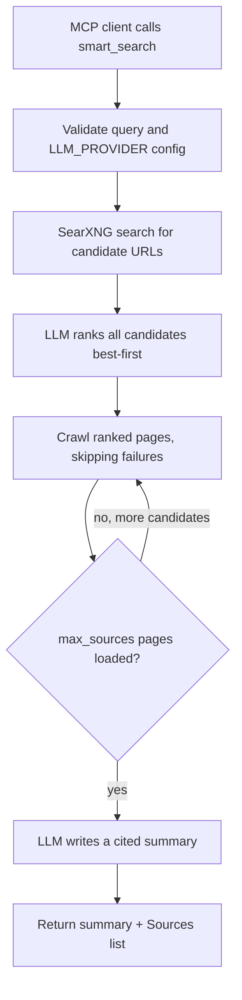

# `smart_search`

## Overview

`smart_search` is a one-shot **answer** tool. Given a question, it runs the whole web-research pipeline internally — search, source selection, crawl, and summarization — and returns a final, synthesized answer with citations. Unlike [`web_search`](web_search.md) (which only *discovers* candidate URLs and expects the model to call `web_fetch` and synthesize the answer itself), `smart_search` does that work for you using an LLM.

The LLM backend is pluggable via `LLM_PROVIDER`:

- `ollama` (default) — a local Ollama server. No API key, no external network call for the ranking/summary step.
- `gemini` — the Google Gemini API. Requires `GEMINI_API_KEY`.

Key capabilities:

- Searches the web through SearXNG for candidate sources (pulling extra candidates so there is room to fall through).
- Asks the configured LLM to rank **all** candidates best-first by relevance.
- Crawls the ranked pages with the same `httpx` → Crawl4AI fetcher used by `web_fetch`, **falling through** to lower-ranked sources when a page times out, blocks the request, or renders no content — until `max_sources` pages load successfully.
- Asks the LLM to write a synthesized, inline-cited summary from the crawled evidence.
- Returns plain text: the summary followed by a numbered `Sources:` list of the URLs actually used.
- Calls the backend directly over `httpx` (no extra Python dependency for either provider) and retries transient `5xx` errors with backoff.



## Prerequisites

Required software:

- Python 3.10 or newer.
- Project Python dependencies from `requirements.txt` (only `httpx` is needed for either LLM backend; no extra package).
- A reachable SearXNG instance with JSON output enabled.
- Optional: the `local-mcp[browser]` extra (Crawl4AI) so JavaScript-rendered candidate pages can be crawled. Without it, such pages are skipped and `smart_search` falls through to the next-ranked source.

Required accounts and credentials:

- With the default `LLM_PROVIDER=ollama`: none — just a running local Ollama server with a pulled model.
- With `LLM_PROVIDER=gemini`: a Google Gemini API key (from Google AI Studio).
- Any SearXNG engines you enable may have their own rate limits or network restrictions.

Required configuration:

- `SEARXNG_BASE_URL`, `SEARXNG_URLS`, or `LOCAL_MCP_SEARXNG_URLS` should point to a SearXNG instance with `json` in `search.formats`.
- If using Gemini, `GEMINI_API_KEY` must be set (see [Setup](#setup)).

## Installation

Install the project dependencies:

```powershell
cd D:\MCP\local-mcp
python -m venv .venv
.\.venv\Scripts\Activate.ps1
python -m pip install -r requirements.txt
```

Optionally install the browser-render fallback so JavaScript-heavy candidate pages can be crawled instead of skipped:

```powershell
python -m pip install ".[browser]"
crawl4ai-setup
```

Install or run SearXNG separately, as described in [`web_search.md`](web_search.md#installation).

For the local Ollama backend, install [Ollama](https://ollama.com) and pull a model:

```powershell
ollama pull qwen2.5:7b
ollama serve
```

## Setup

1. Start or deploy a SearXNG instance with JSON output enabled.
2. Choose an LLM backend in `.env`:

   **Local Ollama (default, no API key):**

   ```env
   LLM_PROVIDER=ollama
   OLLAMA_HOST=http://127.0.0.1:11434
   OLLAMA_MODEL=qwen2.5:7b
   ```

   **Google Gemini:**

   ```env
   LLM_PROVIDER=gemini
   GEMINI_API_KEY=your-gemini-api-key
   # Optional model override (default: gemini-flash-latest)
   GEMINI_MODEL=gemini-flash-latest
   ```

   See [`.env.example`](../.env.example) for the placeholder entries. The Gemini key can also be provided as `GOOGLE_API_KEY`.
3. Point the server at your SearXNG instance:

   ```powershell
   $env:SEARXNG_BASE_URL = "http://127.0.0.1:8888"
   ```

4. Start the MCP server:

   ```powershell
   python -m local_mcp
   ```

For OpenWebUI, start the server in HTTP mode and paste [`integrations/openwebui_tool.py`](../integrations/openwebui_tool.py) into `Tools -> Create Tool`:

```powershell
python -m local_mcp --http
```

> **Note on models:** With `LLM_PROVIDER=ollama`, `OLLAMA_MODEL` must already be pulled locally (`ollama pull <model>`) or requests fail with a 404-style error. With `LLM_PROVIDER=gemini`, `GEMINI_MODEL` defaults to `gemini-flash-latest`, a moving alias that resolves to the current stable Gemini Flash model; some pinned ids (for example `gemini-2.5-flash`) are not available to every API-key tier and return HTTP 404. Override with the env var or the per-call `model` parameter when you need a specific model.

## Usage

The tool accepts these parameters:

| Parameter | Type | Default | Description |
| --- | --- | --- | --- |
| `query` | string | required | The question or topic to research and answer. |
| `max_sources` | integer | `3` | Maximum number of pages to crawl and summarize. Allowed range: `1` to `10`. |
| `time_range` | string | `""` | Optional SearXNG time range: `day`, `month`, or `year`. Empty means any time. |
| `model` | string | `""` | Optional model override for the configured LLM provider. Empty uses `OLLAMA_MODEL` or `GEMINI_MODEL`, whichever `LLM_PROVIDER` selects. |

Typical workflow:

1. Ask an MCP client a factual or research question.
2. The client invokes `smart_search` with the query (and optionally `max_sources`).
3. The tool searches SearXNG, ranks the candidates with the configured LLM, crawls the best pages that load, and asks the LLM to summarize them.
4. The tool returns a finished, cited answer — no follow-up `web_fetch` call is needed.

Example MCP prompt:

```text
Using local-mcp smart_search, tell me why Canberra is the capital of Australia.
```

Example OpenWebUI-style call:

```python
await tools.smart_search(
    query="What is the capital of Australia and why was it chosen?",
    max_sources=2,
)
```

Example returned shape (plain text):

```text
The capital of Australia is **Canberra** [1], [2]. It was selected as a
compromise to resolve the rivalry between Sydney and Melbourne [1], [2]. ...

Sources:
[1] https://example.com/why-canberra-is-the-capital
[2] https://example.org/history-of-canberra
```

When no web results are found, or none of the ranked candidates can be crawled, the tool returns an error message rather than an empty answer (see [Troubleshooting](#troubleshooting)).

## Running the Tool

Run over stdio for MCP desktop clients:

```powershell
python -m local_mcp
```

Run over Streamable HTTP:

```powershell
python -m local_mcp --http
```

Verify the server is up:

```powershell
Invoke-WebRequest http://127.0.0.1:3002/health
```

## Configuration

Supported environment variables:

| Variable | Default | Description |
| --- | --- | --- |
| `LLM_PROVIDER` | `ollama` | Backend used by `smart_search` for ranking and summarization: `ollama` or `gemini`. |
| `OLLAMA_HOST` | `http://127.0.0.1:11434` | Local Ollama server base URL. Used when `LLM_PROVIDER=ollama`. |
| `OLLAMA_MODEL` | `qwen2.5:7b` | Ollama model tag used for ranking and summarization. Must already be pulled. |
| `OLLAMA_TIMEOUT_MS` | `120000` | Per-request timeout for Ollama calls, in milliseconds. |
| `OLLAMA_MAX_RETRIES` | `2` | Retries for transient Ollama `5xx` errors. |
| `OLLAMA_RETRY_BACKOFF_S` | `2` | Base backoff in seconds between Ollama retries (grows linearly per attempt). |
| `GEMINI_API_KEY` | required if `LLM_PROVIDER=gemini` | Google Gemini API key. `GOOGLE_API_KEY` is accepted as an alias. |
| `GEMINI_MODEL` | `gemini-flash-latest` | Gemini model id used for ranking and summarization. |
| `GEMINI_API_BASE` | `https://generativelanguage.googleapis.com/v1beta` | Gemini REST API base URL. |
| `GEMINI_TIMEOUT_MS` | `120000` | Per-request timeout for Gemini calls, in milliseconds. |
| `GEMINI_MAX_RETRIES` | `2` | Retries for transient Gemini `5xx` errors. Auth, quota, and model errors are not retried. |
| `GEMINI_RETRY_BACKOFF_S` | `2` | Base backoff in seconds between retries (grows linearly per attempt). |
| `LOCAL_MCP_SMART_SEARCH_CANDIDATES` | `4` | Candidate multiplier: search pulls `max_sources` × this many URLs (clamped to 6–20) for the LLM to rank. |
| `LOCAL_MCP_SMART_SEARCH_SOURCE_CHARS` | `16000` | Maximum characters of each crawled page passed to the LLM for summarization. |
| `SEARXNG_BASE_URL` | `http://127.0.0.1:8888` | Default SearXNG instance. |
| `SEARXNG_URLS` | unset | Comma-separated failover list. Takes priority over `SEARXNG_BASE_URL`. |
| `LOCAL_MCP_SEARXNG_URLS` | unset | Alias for `SEARXNG_URLS`. |
| `SEARXNG_TIMEOUT_MS` | `LOCAL_MCP_TIMEOUT_MS` or `15000` | SearXNG request timeout in milliseconds. |
| `LOCAL_MCP_TIMEOUT_MS` | `15000` | Page-crawl (httpx) and browser-render timeout in milliseconds. |
| `LOCAL_MCP_MIN_MARKDOWN_CHARS` | `200` | Minimum static Markdown length before browser-render fallback is attempted per page. |
| `MCP_HTTP_HOST` | `127.0.0.1` | HTTP server host. |
| `MCP_HTTP_PORT` | `3002` | HTTP server port. |

Example `.env` (local Ollama, default):

```env
LLM_PROVIDER=ollama
OLLAMA_HOST=http://127.0.0.1:11434
OLLAMA_MODEL=qwen2.5:7b
SEARXNG_BASE_URL=http://127.0.0.1:8888
```

Example `.env` (Gemini):

```env
LLM_PROVIDER=gemini
GEMINI_API_KEY=your-gemini-api-key
GEMINI_MODEL=gemini-flash-latest
SEARXNG_BASE_URL=http://127.0.0.1:8888
```

Example call:

```json
{
  "query": "latest guidance on prompt caching",
  "max_sources": 3,
  "time_range": "year"
}
```

## Troubleshooting

### `smart_search could not reach the local Ollama server`

`ollama serve` isn't running, `OLLAMA_HOST` points to the wrong address, or `OLLAMA_MODEL` hasn't been pulled. Run `ollama serve` and `ollama pull <model>`, then retry.

### `Ollama model '...' was not found (404)`

The configured `OLLAMA_MODEL` hasn't been pulled on this Ollama server. Run `ollama pull <model>` (matching `OLLAMA_MODEL`), or check `ollama list` for available tags.

### `smart_search is set to use Gemini but no API key is configured`

`LLM_PROVIDER=gemini` but `GEMINI_API_KEY` (or `GOOGLE_API_KEY`) is not set. Add it to `.env`, or switch back to `LLM_PROVIDER=ollama`.

### `Gemini rejected the API key (401)` / `(403)`

The key is invalid, disabled, or lacks access to the Generative Language API. Generate a fresh key in Google AI Studio and confirm the API is enabled for the project.

### `Gemini model '...' was not found (404)`

The configured `GEMINI_MODEL` is not available to your key. Use the default `gemini-flash-latest`, or pick a model your key can serve (list them with a `GET` to `https://generativelanguage.googleapis.com/v1beta/models`).

### `Gemini rate-limited the request (429)`

You exceeded the model's quota or rate limit. Wait and retry, reduce request frequency, or switch to a model/tier with more quota. Quota errors are intentionally **not** auto-retried.

### `Gemini returned HTTP 503` / Ollama `5xx`

The model is temporarily overloaded. The client already retries `5xx` errors; if it still fails, retry later or raise `GEMINI_MAX_RETRIES`/`GEMINI_RETRY_BACKOFF_S` (or the `OLLAMA_*` equivalents).

### `Found candidate URLs but could not crawl any of them`

Every ranked candidate failed to load (timeouts, blocks, or JavaScript-only pages with no browser fallback installed). Install the browser extra (`pip install ".[browser]"` then `crawl4ai-setup`), raise `LOCAL_MCP_TIMEOUT_MS`, increase `max_sources`, or widen the query.

### `SearXNG search failed` / `No web results found`

See the SearXNG troubleshooting in [`web_search.md`](web_search.md#troubleshooting): confirm the instance is reachable, JSON output is enabled, and the query returns results.

## References

- Project implementation: [`local_mcp/tools/smart_search.py`](../local_mcp/tools/smart_search.py), [`local_mcp/llm/client.py`](../local_mcp/llm/client.py), [`local_mcp/ollama/client.py`](../local_mcp/ollama/client.py), [`local_mcp/gemini/client.py`](../local_mcp/gemini/client.py), [`local_mcp/web/content.py`](../local_mcp/web/content.py), [`local_mcp/search/searxng.py`](../local_mcp/search/searxng.py), [`integrations/openwebui_tool.py`](../integrations/openwebui_tool.py)
- Related tools: [`web_search.md`](web_search.md), [`web_fetch.md`](web_fetch.md)
- Ollama API (`/api/chat`): <https://github.com/ollama/ollama/blob/main/docs/api.md#generate-a-chat-completion>
- Google Gemini API (`generateContent`): <https://ai.google.dev/api/generate-content>
- Google AI Studio (API keys): <https://aistudio.google.com/app/apikey>
- MCP Python SDK: <https://github.com/modelcontextprotocol/python-sdk>
