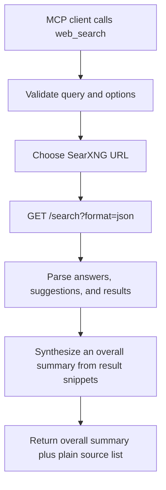

# `web_search`

## Overview

`web_search` is the **discovery** stage of web research. It searches the web through a SearXNG instance and returns a JSON envelope of ranked candidate sources — not a final answer. It is useful when an MCP client needs current web results without calling a commercial search API directly.

Key capabilities:

- Sends search requests to SearXNG's JSON API.
- Supports categories such as `general`, `news`, `images`, or comma-separated combinations.
- Supports language, page number, safe-search, time range, and engine overrides.
- Supports per-call SearXNG URL overrides and environment-based failover.
- Returns each candidate as `{title, url, snippet, relevance_score}`, scores results by engine rank and query keyword overlap, and surfaces the most relevant as `recommended_urls`.
- Emits `requires_fetch` and an embedded `agent_guidance` string that steer the model to call `web_fetch` before answering, so raw snippets are treated as intermediate evidence rather than a final answer.
- Can optionally prefetch the top result(s) server-side (see the follow-up modes) and deliver them as `prefetched_sources`.



## Prerequisites

Required software:

- Python 3.10 or newer.
- Project Python dependencies from `requirements.txt`.
- A reachable SearXNG instance with JSON output enabled.

Required accounts and credentials:

- No account, API key, or token is required by this project.
- Any SearXNG engines you enable may have their own rate limits or network restrictions.

Required configuration:

- `SEARXNG_BASE_URL`, `SEARXNG_URLS`, or `LOCAL_MCP_SEARXNG_URLS` should point to a SearXNG instance.
- SearXNG must allow JSON responses by including `json` in `search.formats`.

## Installation

Install the project dependencies:

```powershell
cd D:\MCP\local-mcp
python -m venv .venv
.\.venv\Scripts\Activate.ps1
python -m pip install -r requirements.txt
```

Install or run SearXNG separately. If using a local SearXNG configuration, this repository includes [`searxng-settings.yml`](../searxng-settings.yml) with the required JSON output enabled:

```yaml
use_default_settings: true

search:
  formats:
    - html
    - json

server:
  secret_key: "change-this-local-dev-secret"
  image_proxy: true
```

With Docker Desktop running, the interactive setup script can restart SearXNG for you:

```powershell
python setup_and_run.py
# choose option 12
```

The menu removes any existing `local-searxng` container, then starts `searxng/searxng:latest` on `http://127.0.0.1:8888`.

## Setup

1. Start or deploy a SearXNG instance.
2. Enable JSON output in SearXNG:

   ```yaml
   search:
     formats:
       - html
       - json
   ```

3. Configure the MCP server to use that instance:

   ```powershell
   $env:SEARXNG_BASE_URL = "http://127.0.0.1:8888"
   ```

4. Optionally configure failover instances:

   ```powershell
   $env:SEARXNG_URLS = "http://127.0.0.1:8888,https://search.example.com"
   ```

5. Start the MCP server:

   ```powershell
   python -m local_mcp
   ```

For OpenWebUI, start the server in HTTP mode:

```powershell
python -m local_mcp --http
```

Then paste [`integrations/openwebui_tool.py`](../integrations/openwebui_tool.py) into OpenWebUI under `Tools -> Create Tool`.

## Usage

The tool accepts these parameters:

| Parameter | Type | Default | Description |
| --- | --- | --- | --- |
| `query` | string | required | Search query sent to SearXNG. |
| `limit` | integer | `8` | Maximum number of results. Allowed range: `1` to `20`. |
| `categories` | string | `general` | SearXNG category or comma-separated categories. |
| `language` | string | `auto` | SearXNG language code or `auto`. |
| `pageno` | integer | `1` | Result page number. Allowed range: `1` to `20`. |
| `safesearch` | integer | `0` | Safe-search level: `0` off, `1` moderate, `2` strict. |
| `time_range` | string | empty | Optional SearXNG time range: `day`, `month`, or `year`. |
| `engines` | string | empty | Optional comma-separated SearXNG engines. |
| `searxng_url` | string | empty | Optional SearXNG base URL for this call only. |

Typical workflow:

1. Ask an MCP client to search for a topic.
2. The client invokes `web_search` with a query and optional filters.
3. The tool calls SearXNG, scores the results, and returns a JSON envelope of ranked candidates with `recommended_urls`, `requires_fetch`, and `agent_guidance`.
4. The model calls `web_fetch` on one or more `recommended_urls` to read the full pages, then analyzes that evidence and writes a synthesized, cited answer. Search snippets alone are not treated as sufficient evidence.

Example MCP prompt:

```text
Using local-mcp, search recent news for SearXNG with categories=news, time_range=month, and limit=5.
```

Example OpenWebUI-style call:

```python
await tools.web_search(
    query="OpenAI Model Context Protocol",
    limit=5,
    categories="general",
    language="auto",
    safesearch=1
)
```

Example returned shape:

```json
{
  "tool": "web_search",
  "stage": "discovery",
  "query": "model context protocol",
  "result_count": 2,
  "requires_fetch": true,
  "workflow": "web_search (discover sources) -> web_fetch (read evidence) -> analyze -> write a cited answer",
  "agent_guidance": "These are candidate sources ... call web_fetch on recommended_urls ...",
  "next_action": "Call web_fetch on one or more recommended_urls ...",
  "recommended_urls": ["https://example.com/page", "https://example.com/other-page"],
  "instant_answers": ["An optional SearXNG instant answer, treated as a hint only."],
  "suggestions": ["alternate query"],
  "results": [
    {
      "rank": 1,
      "title": "Example title",
      "url": "https://example.com/page",
      "snippet": "Short preview text from the result.",
      "relevance_score": 0.92,
      "engines": ["duckduckgo"],
      "published_date": null
    }
  ]
}
```

`instant_answers` (SearXNG instant answers) and `suggestions` (alternate queries) appear when present and are hints only. Enable a follow-up mode (`LOCAL_MCP_WEB_SEARCH_FOLLOW_UP=fetch_first` or `summarize`) to have the server fetch the top result(s) and attach them as a `prefetched_sources` array; `requires_fetch` then becomes `false` (see [Configuration](#configuration)).

## Running the Tool

Run over stdio for MCP desktop clients:

```powershell
python -m local_mcp
```

Run over Streamable HTTP:

```powershell
python -m local_mcp --http
```

Verify the server is up:

```powershell
Invoke-WebRequest http://127.0.0.1:3002/health
```

Use the installed console script when the package is installed in editable or package mode:

```powershell
local-mcp --http
```

## Configuration

Supported environment variables:

| Variable | Default | Description |
| --- | --- | --- |
| `SEARXNG_BASE_URL` | `http://127.0.0.1:8888` | Default SearXNG instance. |
| `SEARXNG_URLS` | unset | Comma-separated failover list. Takes priority over `SEARXNG_BASE_URL`. |
| `LOCAL_MCP_SEARXNG_URLS` | unset | Alias for `SEARXNG_URLS`. |
| `SEARXNG_TIMEOUT_MS` | `LOCAL_MCP_TIMEOUT_MS` or `15000` | Search request timeout in milliseconds. |
| `LOCAL_MCP_WEB_SEARCH_FOLLOW_UP` | `none` | `fetch_first` prefetches the top result, `summarize` prefetches the top `LOCAL_MCP_WEB_SEARCH_FOLLOW_UP_LIMIT` results, and `none` returns discovery results only. Prefetched pages are attached as `prefetched_sources` and set `requires_fetch` to `false`. |
| `LOCAL_MCP_WEB_SEARCH_FOLLOW_UP_LIMIT` | `3` | Number of top results prefetched by the `summarize` follow-up mode (1-5). |
| `LOCAL_MCP_WEB_SEARCH_FOLLOW_UP_RENDER` | `auto` | Fetch mode used by follow-up prefetching: `auto`, `static`, or `browser`. |
| `LOCAL_MCP_WEB_SEARCH_FOLLOW_UP_MAX_CHARS` | `50000` | Maximum page characters used by follow-up prefetching. |
| `LOCAL_MCP_WEB_SEARCH_RECOMMENDED_URLS` | `3` | Number of top-ranked URLs returned in `recommended_urls` (1-10). |
| `MCP_HTTP_HOST` | `127.0.0.1` | HTTP server host. |
| `MCP_HTTP_PORT` | `3002` | HTTP server port. |

Example `.env`:

```env
SEARXNG_BASE_URL=http://127.0.0.1:8888
SEARXNG_TIMEOUT_MS=20000
MCP_HTTP_HOST=127.0.0.1
MCP_HTTP_PORT=3002
```

Example per-call override:

```json
{
  "query": "privacy preserving search",
  "limit": 10,
  "categories": "general,news",
  "time_range": "month",
  "searxng_url": "https://search.example.com"
}
```

## Troubleshooting

### `SearXNG search failed: Search query is required.`

The `query` parameter was empty or only whitespace. Provide a non-empty query.

### `refused JSON search`

SearXNG returned `403` because JSON output is disabled. Enable JSON output:

```yaml
search:
  formats:
    - html
    - json
```

Restart SearXNG after changing the setting.

### `did not return valid JSON`

The configured URL may point to a non-SearXNG service, a login page, or a SearXNG instance that does not expose JSON search. Confirm that this works in a browser:

```text
http://127.0.0.1:8888/search?q=test&format=json
```

### `Could not connect` or timeout errors

Check that the SearXNG process is running and reachable from the MCP server machine. Increase the timeout if the instance or engines are slow:

```powershell
$env:SEARXNG_TIMEOUT_MS = "30000"
```

### No results returned

Try a broader query, different `categories`, or different `engines`. Some engines may temporarily block or rate-limit SearXNG.

## References

- Project implementation: [`local_mcp/tools/search.py`](../local_mcp/tools/search.py), [`local_mcp/search/searxng.py`](../local_mcp/search/searxng.py), [`integrations/openwebui_tool.py`](../integrations/openwebui_tool.py)
- Project SearXNG sample config: [`searxng-settings.yml`](../searxng-settings.yml)
- SearXNG Search API: <https://docs.searxng.org/dev/search_api.html>
- SearXNG settings documentation: <https://docs.searxng.org/admin/settings/settings.html>
- MCP Python SDK: <https://github.com/modelcontextprotocol/python-sdk>
