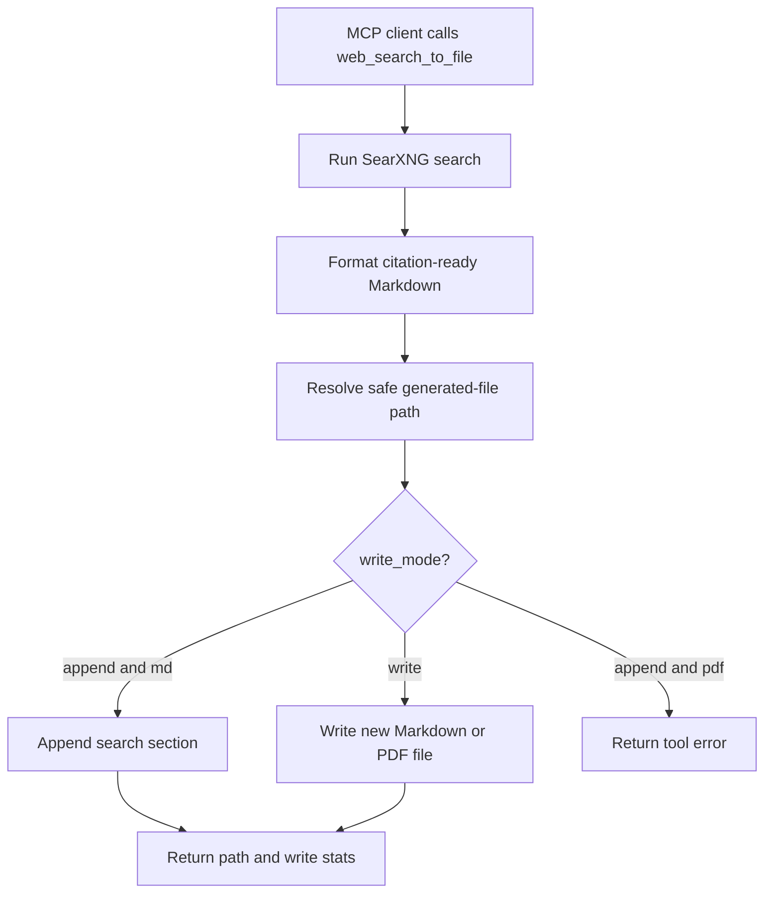

# `web_search_to_file`

Search the web through SearXNG and write citation-ready results directly to a generated Markdown or PDF file.

This tool is useful for smaller AI models because the model only supplies the search request and target filename. The server performs the search, formats the result Markdown, and writes it to disk without requiring the model to pass the search output back through a large `content` argument. PDF output renders the same citation-ready content into a PDF file.

## How It Works



## Parameters

| Parameter | Type | Default | Description |
| --- | --- | --- | --- |
| `query` | string | required | Search query sent to SearXNG. |
| `filename` | string | required | Output Markdown or PDF filename or relative path. The matching extension is appended when omitted. |
| `limit` | integer | `8` | Maximum number of results. Allowed range: `1` to `20`. |
| `categories` | string | `general` | SearXNG category or comma-separated categories. |
| `language` | string | `auto` | SearXNG language code or `auto`. |
| `pageno` | integer | `1` | Result page number. Allowed range: `1` to `20`. |
| `safesearch` | integer | `0` | Safe-search level: `0` off, `1` moderate, `2` strict. |
| `time_range` | string | empty | Optional SearXNG time range: `day`, `month`, or `year`. |
| `engines` | string | empty | Optional comma-separated SearXNG engines. |
| `searxng_url` | string | empty | Optional SearXNG base URL for this call only. |
| `write_mode` | string | `append` | `append` adds a search section to the target file. `write` creates/replaces content using normal overwrite rules. |
| `overwrite` | boolean | `false` | Replace an existing file when `write_mode` is `write`. |
| `ensure_trailing_newline` | boolean | `true` | Append a trailing newline to the generated Markdown section. Ignored for PDF output. |
| `file_type` | string | `md` | Output file type. Supports `md`/`markdown` and `pdf`. A `.pdf` filename also selects PDF output. |

## Output File Format

Each call writes a section like this:

```markdown
## Web Search: example query

Search query: "example query"
SearXNG instance: http://127.0.0.1:8888/
Results returned: 2

Results:
1. [Example title](https://example.com/page)
   Example snippet text.
   URL: https://example.com/page
   Engines: duckduckgo | Score: 1
```

## Example

```json
{
  "query": "Model Context Protocol examples",
  "filename": "research/mcp-notes",
  "limit": 5,
  "write_mode": "append"
}
```

With `LOCAL_MCP_FILE_OUTPUT_DIR=~/Downloads/local-mcp`, this appends the search section to:

```text
~/Downloads/local-mcp/research/mcp-notes.md
```

## PDF Example

```json
{
  "query": "Model Context Protocol examples",
  "filename": "research/mcp-notes.pdf",
  "limit": 5,
  "write_mode": "write"
}
```

With `LOCAL_MCP_FILE_OUTPUT_DIR=~/Downloads/local-mcp`, this writes:

```text
~/Downloads/local-mcp/research/mcp-notes.pdf
```

PDF output does not support `append`/chunk mode. Use `write_mode="write"` and pass `overwrite=true` when replacing an existing PDF.

## Configuration

This tool uses both the SearXNG configuration from `web_search` and the generated-file output configuration from `generate_file`.

Required:

- A reachable SearXNG instance with JSON output enabled.
- `LOCAL_MCP_FILE_OUTPUT_DIR` or `LOCAL_MCP_DOWNLOAD_DIR` for the generated file destination.

## References

- Search implementation: [`local_mcp/tools/search.py`](../local_mcp/tools/search.py), [`local_mcp/search/searxng.py`](../local_mcp/search/searxng.py)
- File implementation: [`local_mcp/tools/file_generation.py`](../local_mcp/tools/file_generation.py), [`local_mcp/file_generation/markdown.py`](../local_mcp/file_generation/markdown.py)
