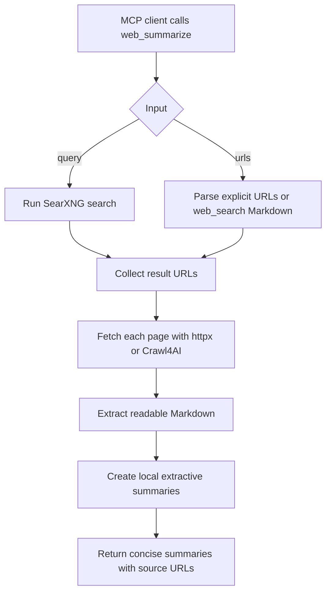

# `web_summarize`

Search or fetch multiple URLs and return concise summaries instead of whole page content.

Use this when you want the server to crawl several result URLs and produce short, citation-ready summaries. It can work in two modes:

- Search mode: pass `query`; the tool searches SearXNG, fetches the result URLs, and summarizes them.
- URL mode: pass `urls`; the tool summarizes explicit URLs, pasted `web_search` Markdown, or Markdown links.

## How It Works



## Parameters

| Parameter | Type | Default | Description |
| --- | --- | --- | --- |
| `query` | string | empty | Optional search query. When provided, SearXNG result URLs are fetched and summarized. |
| `urls` | string | empty | Optional URLs to summarize. Accepts comma/newline-separated URLs, raw `web_search` Markdown, or Markdown links. |
| `limit` | integer | `5` | Maximum number of URLs to fetch and summarize. Allowed range: `1` to `20`. |
| `categories` | string | `general` | SearXNG category or comma-separated categories when `query` is provided. |
| `language` | string | `auto` | SearXNG language code when `query` is provided. |
| `pageno` | integer | `1` | SearXNG result page number when `query` is provided. |
| `safesearch` | integer | `0` | Safe-search level when `query` is provided: `0` off, `1` moderate, `2` strict. |
| `time_range` | string | empty | Optional SearXNG time range when `query` is provided: `day`, `month`, or `year`. |
| `engines` | string | empty | Optional comma-separated SearXNG engines override when `query` is provided. |
| `searxng_url` | string | empty | Optional SearXNG base URL when `query` is provided. |
| `render` | string | `auto` | Fetch mode for each URL: `auto`, `static`, or `browser`. |
| `selector` | string | empty | Optional CSS selector to summarize a specific page region. |
| `summary_sentences` | integer | `3` | Maximum sentences per page summary. Allowed range: `1` to `8`. |
| `max_chars_per_page` | integer | `30000` | Maximum extracted page characters to consider before summarizing. |
| `include_failures` | boolean | `true` | Include URLs that failed to fetch in the response. |

## Search Example

```json
{
  "query": "Model Context Protocol examples",
  "limit": 5,
  "summary_sentences": 3
}
```

## URL Example

```json
{
  "urls": "https://example.com/article-1\nhttps://example.com/article-2",
  "render": "static",
  "limit": 2
}
```

You can also paste a previous `web_search` response into `urls`; the tool extracts raw URLs and Markdown link targets.

## Output

The tool returns:

- Request metadata, including query, SearXNG instance, fetch mode, and number of summarized pages.
- An overall extractive summary.
- Per-source summaries with source links, final URLs, status codes, render method, extracted character counts, search snippets when available, and warnings.
- Optional fetch failures.

It does not return the full crawled page content.

## Configuration

Supported environment variables:

| Variable | Default | Description |
| --- | --- | --- |
| `LOCAL_MCP_TIMEOUT_MS` | `15000` | Timeout for static page fetches and Crawl4AI runs. |
| `LOCAL_MCP_USER_AGENT` | `local-mcp/1.0 (+https://github.com/your-org/local-mcp)` | User-Agent sent to target websites. |
| `LOCAL_MCP_MIN_MARKDOWN_CHARS` | `200` | Static Markdown/text length below which `auto` mode attempts browser fallback. |
| `LOCAL_MCP_WEB_SUMMARY_CONCURRENCY` | `4` | Maximum pages fetched concurrently by `web_summarize`. |

## References

- Project implementation: [`local_mcp/tools/web.py`](../local_mcp/tools/web.py), [`local_mcp/web/html.py`](../local_mcp/web/html.py), [`local_mcp/web/fetcher.py`](../local_mcp/web/fetcher.py)
- Search implementation: [`local_mcp/search/searxng.py`](../local_mcp/search/searxng.py)
